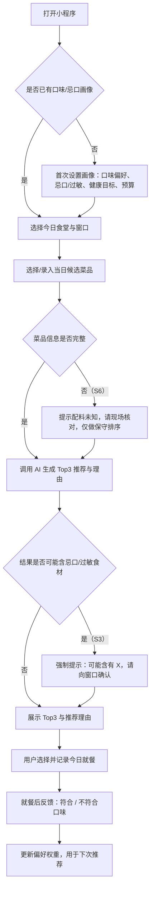
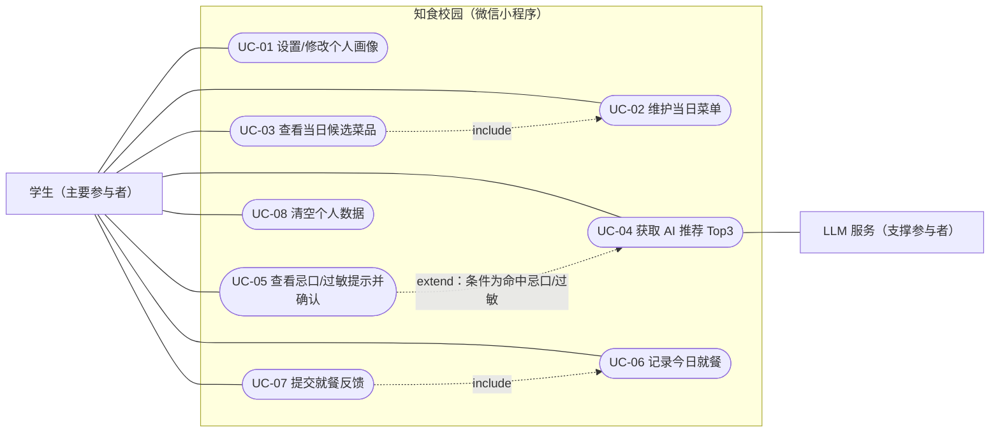

# 图示 Mermaid 源码（知食校园）

> 报告正文已嵌入渲染后的 PNG；本文件保存 Mermaid 源码，供修改后重新渲染。
> 渲染脚本：`tools/render-usecase.ps1`（用例图）、`tools/render-flowchart.ps1`（流程图）。

## 图3-1 核心用户流程图

```mermaid
flowchart TD
    A["打开小程序"] --> B{"是否已有口味/忌口画像"}
    B -- "否" --> C["首次设置画像：口味偏好、忌口/过敏、健康目标、预算"]
    B -- "是" --> D["选择今日食堂与窗口"]
    C --> D
    D --> E["选择/录入当日候选菜品"]
    E --> F{"菜品信息是否完整"}
    F -- "否（S6）" --> G["提示配料未知，请现场核对，仅做保守排序"]
    F -- "是" --> H["调用 AI 生成 Top3 推荐与理由"]
    G --> H
    H --> I{"结果是否可能含忌口/过敏食材"}
    I -- "是（S3）" --> J["强制提示：可能含有 X，请向窗口确认"]
    I -- "否" --> K["展示 Top3 与推荐理由"]
    J --> K
    K --> L["用户选择并记录今日就餐"]
    L --> M["就餐后反馈：符合 / 不符合口味"]
    M --> N["更新偏好权重，用于下次推荐"]
```

## 图B-1 用例图

```mermaid
flowchart LR
    U["学生（主要参与者）"]
    L["LLM 服务（支撑参与者）"]
    subgraph SYS["知食校园（微信小程序）"]
        UC01(["UC-01 设置/修改个人画像"])
        UC02(["UC-02 维护当日菜单"])
        UC03(["UC-03 查看当日候选菜品"])
        UC04(["UC-04 获取 AI 推荐 Top3"])
        UC05(["UC-05 查看忌口/过敏提示并确认"])
        UC06(["UC-06 记录今日就餐"])
        UC07(["UC-07 提交就餐反馈"])
        UC08(["UC-08 清空个人数据"])
    end
    U --- UC01
    U --- UC02
    U --- UC03
    U --- UC04
    U --- UC05
    U --- UC06
    U --- UC07
    U --- UC08
    UC04 --- L
    UC03 -.->|include| UC02
    UC05 -.->|extend：条件为命中忌口/过敏| UC04
    UC07 -.->|include| UC06
```
